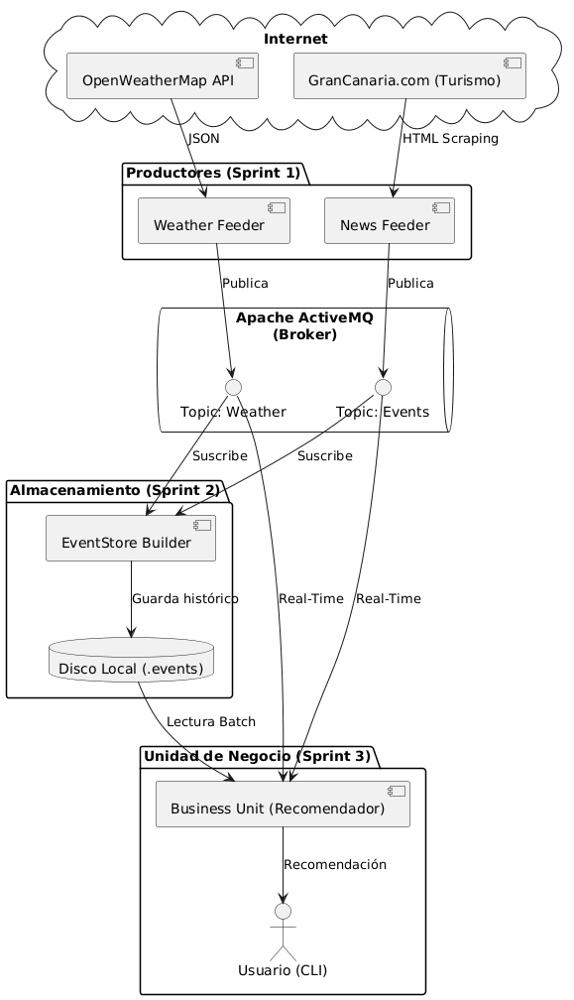
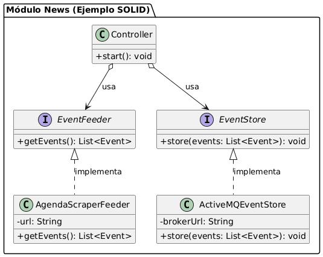

# Eventos Canarios

Bienvenidos a **Eventos Canarios**, nuestro proyecto final para la asignatura de Desarrollo de Aplicaciones para Ciencia de Datos. Hemos desarrollado un sistema que recopila información en tiempo real para recomendar planes culturales en la isla de Gran Canaria, cruzando datos de diferentes fuentes.

## 💡 El Problema y nuestra Propuesta de Valor

Organizar el tiempo libre a veces es complicado porque la información está separada: por un lado miras la previsión del tiempo y por otro buscas los eventos en páginas de cultura. Además, es muy fácil planear una salida al aire libre y que el clima arruine el día.

Nuestra **propuesta de valor** es solucionar esto. No hemos creado un simple buscador de eventos, sino un recomendador inteligente que hace el trabajo por el usuario. Nuestro sistema:
1. Recopila automáticamente la agenda cultural y la previsión meteorológica.
2. Cruza ambos datos en nuestra unidad central (*Business Unit*).
3. Analiza la situación meteorológica (riesgo de lluvia, altas temperaturas, etc.).
4. Filtra los eventos geográficamente y ofrece un consejo claro y personalizado para que sepas qué plan hacer y qué ropa llevar.


## ⚙️ Arquitectura del Sistema y Decisiones Técnicas

Para construir este sistema hemos implementado una arquitectura modular y escalable. A continuación, explicamos las decisiones técnicas más importantes de cada componente.

### 1. Las Fuentes de Datos (APIs y Web Scraping)
Necesitábamos fuentes de datos que fueran fiables y fáciles de procesar en Java:
* **El Clima:** Utilizamos la API de **OpenWeatherMap**. Es un estándar en la industria, gratuita y nos devuelve los datos meteorológicos en un formato JSON muy estructurado y fácil de leer.
* **Los Eventos:** Tras analizar varias opciones, decidimos hacer *web scraping* con la librería **Jsoup** sobre la agenda del **Portal Oficial de Turismo de Gran Canaria** (`grancanaria.com`). Elegimos esta web porque su estructura HTML es estable, lo que nos garantiza poder extraer la fecha, el título y la ubicación sin depender de cargas dinámicas complejas.

### 2. El Broker de Mensajería (Apache ActiveMQ)
En lugar de conectar los módulos directamente, hemos usado un patrón **Publisher/Subscriber**.
Nuestros módulos recolectores (*Weather Feeder* y *News Feeder*) actúan como productores. Cuando descargan información, la empaquetan en archivos JSON y la publican en canales específicos (`Topics`) de nuestro broker local de **Apache ActiveMQ**.

*(Diagrama de la Arquitectura del Sistema)*


*(Diagrama de la Arquitectura de la Aplicación)*

### 3. El EventStore (Almacenamiento Histórico)
Para no perder ningún dato, hemos creado el módulo `eventstore-builder`. Este módulo es un "Suscriptor Duradero" (Durable Subscriber). Se conecta a ActiveMQ y guarda automáticamente cada mensaje que circula por la red en archivos `.events` dentro del disco duro. Esto nos crea un historial (Data Lake) que podemos consultar en el futuro.

### 4. La Business Unit y el Datamart (Arquitectura Lambda)
El núcleo de nuestro recomendador es el módulo `business-unit`. Para procesar la información, hemos implementado una solución inspirada en la **Arquitectura Lambda**, trabajando a dos velocidades:
* **Procesamiento Batch:** Al iniciar, el programa lee los archivos históricos del disco duro para tener el contexto de los días anteriores.
* **Procesamiento en Streaming (Real-Time):** Al mismo tiempo, se suscribe a ActiveMQ para recibir las últimas actualizaciones de clima y eventos en directo.

**El Datamart en Memoria:**
Toda esta información converge en nuestra clase `InMemoryDatamart`. El valor técnico de este componente es vital, ya que realiza dos tareas de limpieza críticas:
1. **Normalización de Fechas:** La API del clima y la web de eventos nos dan las fechas en formatos completamente distintos. El Datamart procesa ambas y las estandariza al formato `YYYY-MM-DD` para poder cruzarlas.
2. **Control de Duplicados:** Al recibir datos constantemente en tiempo real, es normal recibir el mismo evento varias veces. El Datamart filtra y elimina los duplicados antes de mostrarlos al usuario.


## 📐 Principios de Diseño y Patrones Aplicados

Para que el código sea fácil de entender, mantener y evaluar, hemos aplicado buenas prácticas de ingeniería de software a lo largo de todos los módulos.

**Clean Architecture y Separación de Responsabilidades**
Hemos organizado el código en paquetes con responsabilidades únicas (`model`, `store`, `feeder`, `control` o `view`). De esta forma, la lógica principal de nuestro programa está totalmente separada de los detalles técnicos, como la conexión a internet o el motor de la base de datos.

**Principios SOLID (Inversión de Dependencias)**
Nuestros controladores no dependen de clases concretas, sino de **Interfaces** (como `EventFeeder` o `WeatherStore`). Esto nos da una flexibilidad enorme. De hecho, gracias a este diseño, pudimos cambiar la página web de la que extraíamos los eventos simplemente creando una clase nueva, ¡sin tener que modificar ni una sola línea del controlador o de la base de datos!

**Patrón Publisher / Subscriber**
Es el corazón de nuestra comunicación. En lugar de que los módulos estén conectados entre sí de forma rígida, están totalmente desacoplados. Los recolectores de datos (Publishers) simplemente "publican" sus mensajes en ActiveMQ sin saber quién los va a leer. Por otro lado, la unidad de negocio y el almacenamiento histórico (Subscribers) "escuchan" esos canales y reaccionan de forma automática e independiente.


## 🚀 Instrucciones de Ejecución y Configuración

Para probar nuestro proyecto, es muy importante compilarlo e iniciar los módulos en el orden correcto, ya que es un sistema basado en eventos.

**Requisitos previos:**
* Tener instalado **Java 21** y **Maven**.
* Tener descargado el broker **Apache ActiveMQ**.
* *Nota de configuración:* La API Key de OpenWeatherMap y la URL del broker local (`tcp://localhost:61616`) ya están configuradas por defecto en las clases correspondientes, por lo que no necesitas modificar ningún archivo `.properties`.

**Paso 1: Compilar el proyecto**
Abre una terminal en la carpeta raíz del proyecto (donde está el archivo `pom.xml` padre) y ejecuta el siguiente comando para compilar todos los módulos:
`mvn clean install`

**Paso 2: Iniciar el sistema (Orden estricto)**
1. **Encender el Broker:** Abre una terminal, navega hasta la carpeta `bin` de tu instalación de ActiveMQ y ejecuta el comando `activemq start`. Déjalo abierto en segundo plano.
2. **Iniciar el Historial (EventStore):** En tu IDE, ejecuta el archivo `Main.java` del módulo `eventstore-builder`. Es importante iniciarlo primero para que empiece a escuchar y no se pierda ningún dato histórico.
3. **Iniciar los Recolectores (Feeders):** Ejecuta los archivos `Main.java` de los módulos `weather` y `news`. En sus consolas verás cómo descargan la información de internet y la publican en ActiveMQ.
4. **Iniciar la Interfaz (Business Unit):** Por último, ejecuta el `Main.java` del módulo `business-unit`. Este módulo leerá el historial, se conectará en tiempo real al broker y abrirá el menú interactivo para el usuario.
## 💻 Ejemplo de Uso

Una vez iniciada la `business-unit`, el programa te pedirá que introduzcas una fecha. Aquí tienes un ejemplo de lo que ocurre cuando el usuario interactúa con el sistema:

```text
=========================================================
 🌴 BIENVENIDO AL RECOMENDADOR DE PLANES DE CANARIAS 🌴 
=========================================================

👉 Escribe una fecha (formato YYYY-MM-DD) o 'salir' para terminar:
2026-05-20

--- 📅 Resultados para el 2026-05-20 ---
🌤️ Clima: 21.5°C, Humedad: 60%, Prob. Lluvia: 0.0%
💡 RECOMENDACIÓN: Condiciones meteorológicas excelentes. ¡Día ideal para disfrutar de la oferta cultural! ☀️

🎭 Eventos culturales en Gran Canaria:
  1. Concierto Sinfónico de Primavera (Lugar: Auditorio Alfredo Kraus - Las Palmas)
  2. Exposición de Arte Moderno (Lugar: CAAM - Las Palmas)
----------------------------------------

